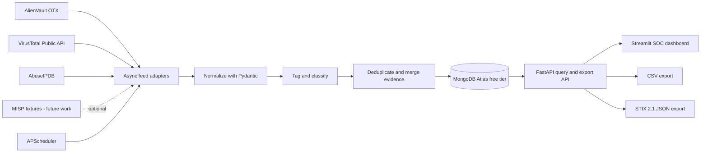

# Architecture

## System Overview

The system is an asynchronous ingestion and query pipeline. Feed adapters fetch provider data, the normalization layer validates and converts it into a provider-independent IOC document, and MongoDB stores the deduplicated result. FastAPI serves query and export operations, while Streamlit provides the operator-facing dashboard.

## Data Flow

1. APScheduler triggers an adapter according to the configured interval.
2. Each adapter calls its provider with `httpx.AsyncClient`, applies provider-specific rate-limit handling, and emits raw records.
3. The normalization service validates the record and maps it to the common IOC schema.
4. The tagging service assigns controlled threat tags from provider labels and deterministic rules.
5. The deduplication service uses the normalized `deduplication_key` to upsert one IOC document and merge source evidence, timestamps, and confidence.
6. Repository methods read from MongoDB for API search, metrics, detail views, and export serialization.
7. FastAPI returns validated response models. Streamlit consumes those endpoints and renders the SOC dashboard.

## Normalized IOC Schema

The following is the Phase 1 domain contract. The executable Pydantic implementation lives in `app/models/ioc.py` and is covered by focused tests in `tests/test_ioc_model.py`.

| Field | Type | Required | Description |
|---|---|---:|---|
| `indicator` | string | yes | Canonical IOC value, such as an IP, domain, URL, email, or hash. |
| `indicator_type` | enum string | yes | `ipv4`, `ipv6`, `domain`, `url`, `email`, `md5`, `sha1`, `sha256`, or `file_name`. |
| `deduplication_key` | string | yes | Lowercase canonical key composed from type and indicator. Unique in MongoDB. |
| `threat_tags` | array of enum strings | yes | Controlled labels such as `malware`, `phishing`, `c2`, `botnet`, `exploit`, or `suspicious`. |
| `confidence_score` | number 0-100 | yes | Normalized confidence score derived from provider evidence. |
| `sources` | array of objects | yes | Provider evidence, including provider name, source record ID, source URL, and observed timestamps. |
| `first_seen` | UTC datetime or null | yes | Earliest known observation across merged sources. |
| `last_seen` | UTC datetime or null | yes | Most recent known observation across merged sources. |
| `created_at` | UTC datetime | yes | Time the canonical document was first stored. |
| `updated_at` | UTC datetime | yes | Time the canonical document was last changed. |
| `raw_metadata` | object | no | Safe, provider-specific metadata retained for analyst inspection. Secrets and authorization headers are excluded. |

### Source Evidence Object

Each `sources` item contains `provider`, `record_id` (nullable), `source_url` (nullable), `confidence_score` (nullable), `first_seen` (nullable), `last_seen` (nullable), and `metadata` (object). Provider names are `otx`, `virustotal`, `abuseipdb`, or `misp_fixture`.

### MongoDB Constraints

The `iocs` collection will have a unique index on `deduplication_key`, indexes on `indicator`, `indicator_type`, `threat_tags`, `last_seen`, and `sources.provider`, and a text/search strategy selected during the API phase. MongoDB timestamps are stored as UTC-aware datetimes.

## Component Boundaries

- `app/feeds`: provider protocols, adapters, response parsing, and quota-aware requests.
- `app/services`: provider-independent normalization, tagging, deduplication, and orchestration.
- `app/models`: Pydantic contracts shared by adapters, repositories, and API responses.
- `app/db`: Motor client lifecycle, indexes, and persistence operations.
- `app/api`: HTTP boundary only; business rules remain in services.
- `app/exports`: serializers that accept validated domain objects.
- `dashboard`: presentation and user interaction through the API, without direct database access.
