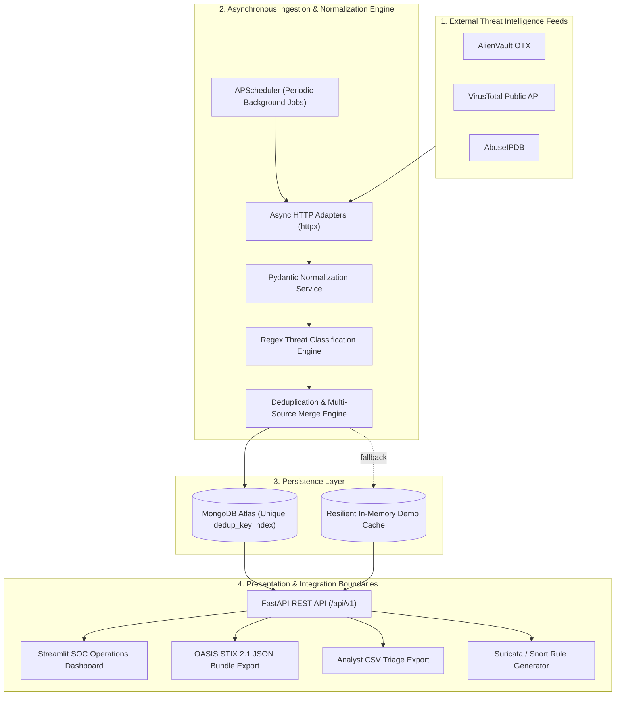

# Threat Intelligence Feed Integrator & SOC Platform

[](https://github.com/fragoo-guy/threat-intel-feed-integrator/actions/workflows/ci.yml)


An enterprise-grade Cyber Threat Intelligence (CTI) Aggregation, Normalization, Deduplication, and SOC Dashboard platform. Built to tackle security operations alert fatigue by collecting observables from multiple open-source feeds, resolving duplicate indicators, applying multi-source confidence corroboration boosts, mapping MITRE ATT&CK® techniques, and generating ready-to-deploy Suricata NIDS detection rules.

---

## Architecture Overview



---

## Key Features

1. **Multi-Feed Asynchronous Ingestion**:
   - Collects threat observables periodically from **AlienVault OTX**, **VirusTotal**, and **AbuseIPDB** while strictly respecting free-tier API quotas.
2. **Deterministic Deduplication & Evidence Merging**:
   - Computes canonical hash keys (`type:indicator`) to eliminate duplicates across feeds.
   - Combines provider evidences, expands observation time bounds (`first_seen` / `last_seen`), and calculates an automatic **+10% corroboration confidence boost** per independent source.
3. **Automated Threat Tagging & MITRE ATT&CK® Enterprise Mapping**:
   - Categorizes observables into 6 core threat tags: `malware`, `phishing`, `c2`, `botnet`, `exploit`, and `suspicious`.
   - Maps tags to MITRE ATT&CK Enterprise techniques (`T1071`, `T1566`, `T1190`, `T1204`, `T1584`, `T1583`) with direct reference links.
4. **Active Defense: Suricata / Snort NIDS Rule Generation**:
   - Generates actionable, copy-pasteable network intrusion detection rules for high-confidence indicators.
5. **Standardized SIEM / SOAR Exports**:
   - **OASIS STIX 2.1 JSON Bundles**: Ready for ingestion into Splunk, Microsoft Sentinel, or Cortex XSOAR.
   - **Analyst CSV Spreadsheets**: Flattened indicator tables for rapid triage and ticketing.
6. **Dark-Mode Streamlit SOC Dashboard**:
   - Real-time telemetry cards, interactive distribution charts, filterable investigation grid, and deep-dive evidence inspection drawers.
7. **Resilient Offline / Demo Mode**:
   - Operates smoothly out-of-the-box with pre-seeded realistic threat intelligence even if external databases or API keys are unavailable.
8. **Decoupled Enterprise Architecture**:
   - The operator-facing Streamlit dashboard strictly interacts through validated FastAPI REST endpoints with zero direct database coupling.


---

## Quickstart Guide

### Option A: 1-Command Run with Docker (Recommended)

Make sure you have Docker installed, then run:

```bash
docker compose up -d
```

- **SOC Dashboard**: [http://localhost:8501](http://localhost:8501)
- **FastAPI REST API**: [http://127.0.0.1:8000](http://127.0.0.1:8000)
- **Interactive Swagger Docs**: [http://127.0.0.1:8000/docs](http://127.0.0.1:8000/docs)

---

### Option B: Local Python Setup

1. **Clone the repository and enter the project folder**:
   ```powershell
   git clone https://github.com/fragoo-guy/threat-intel-feed-integrator.git
   cd threat-intel-feed-integrator
   ```

2. **Create and activate a virtual environment**:
   ```powershell
   python -m venv .venv
   .\.venv\Scripts\Activate.ps1
   ```

3. **Install dependencies**:
   ```powershell
   pip install -r requirements.txt
   ```

4. **Configure your `.env` file**:
   Copy `.env.example` to `.env` and fill in your keys (optional for demo mode):
   ```powershell
   cp .env.example .env
   ```

5. **Start the FastAPI backend (Terminal 1)**:
   ```powershell
   uvicorn app.main:app --reload
   ```

6. **Start the Streamlit dashboard (Terminal 2)**:
   ```powershell
   streamlit run dashboard/app.py
   ```

---

## API Endpoints Reference

| Method | Endpoint | Description |
|---|---|---|
| `GET` | `/health` | Application status and per-feed sync telemetry |
| `GET` | `/api/v1/metrics` | High-level SOC telemetry (total IOCs, high-confidence counts, distributions) |
| `GET` | `/api/v1/iocs` | Filterable, paginated search (regex, indicator type, threat tag, provider, min confidence) |
| `GET` | `/api/v1/iocs/{deduplication_key}` | Detailed inspection view showing corroborating evidence and metadata |
| `POST` | `/api/v1/feeds/{provider}/sync` | Trigger an immediate manual ingestion run for a specific provider |
| `GET` | `/api/v1/export/csv` | Download filtered indicators as an analyst CSV spreadsheet |
| `GET` | `/api/v1/export/stix` | Download filtered indicators as a standardized STIX 2.1 JSON bundle |

---

## Automated Testing

The platform includes a comprehensive test suite (45 unit and integration tests) verifying domain models, adapters, normalization, deduplication, tagging, API routes, and dashboard utilities with zero live API quota consumption:

```powershell
pytest -v
```

---

## Project Structure

```text
├── .github/workflows/   # Automated CI/CD GitHub Actions pipeline
├── app/
│   ├── api/             # FastAPI routers, endpoints, and dependency injection
│   ├── db/              # Motor async client, MongoDB repository & indexes
│   ├── exports/         # CSV and STIX 2.1 JSON bundle serializers
│   ├── feeds/           # Feed adapters (OTX, AbuseIPDB, VirusTotal) & normalizer
│   ├── fixtures/        # Realistic CTI sample observables for demo mode
│   ├── models/          # Pydantic 2 canonical IOC domain contract
│   ├── services/        # Deduplication, regex tagging, and scheduler orchestration
│   └── main.py          # FastAPI application entrypoint & lifespan management
├── dashboard/
│   ├── api_client.py    # Decoupled HTTP API client
│   ├── mitre.py         # MITRE ATT&CK® mapping and Suricata NIDS rule generator
│   └── app.py           # Streamlit SOC Analyst operations dashboard
├── tests/               # 45 isolated pytest unit and integration tests
├── docker-compose.yml   # Multi-service container orchestration
├── Dockerfile           # Optimized Python 3.11 container definition
├── requirements.txt     # Pinned production dependencies
└── PROGRESS.md          # 6-phase engineering lifecycle and review gates
```

---

## Security & Ethics Notice

- All API keys and MongoDB connection secrets are kept strictly in `.env` and are excluded from Git version control.
- Indicators collected are security threat intelligence data. Ensure proper authorization when collecting or querying observables.

---

## License

This project is licensed under the [MIT License](LICENSE)...
